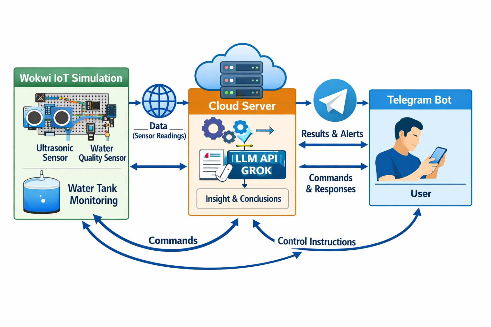

# Smart Water Tank Monitoring (IoT + Telegram + AI)

## Permasalahan
Permasalahan yang sering terjadi adalah banyak orang lupa memperhatikan kualitas air di toren karena sudah lama tidak dibersihkan. Hal ini juga disebabkan oleh posisi toren yang biasanya berada di tempat tinggi dan jauh sehingga kondisi air di dalamnya sulit dipantau.

Proyek ini dibuat untuk membantu memantau **kualitas air toren** dan **kondisi level air** secara otomatis, memberikan **peringatan (alert)** ketika air tidak layak digunakan, serta menyediakan tombol Telegram untuk mendapatkan **info realtime** kapan pun dibutuhkan. Sistem juga dapat mengontrol **pompa air otomatis** menggunakan relay untuk menjaga level toren.

---

## Tujuan Sistem
- Memantau kualitas air toren secara berkala (real-time monitoring).
- Mengirim **alert otomatis** jika air terdeteksi **tidak layak**.
- Memberikan **laporan lengkap** saat diminta (tombol Telegram).
- Menghasilkan penjelasan yang **mudah dipahami user awam** menggunakan AI.
- Mengontrol pompa air otomatis berdasarkan level toren dan kondisi air.

---
## Arsitektur Sistem



## Fitur Utama
- **Monitoring sensor** (pH, turbidity/kekeruhan, TDS, suhu, level air).
- **Klasifikasi kelayakan air** berdasarkan standar yang digunakan.
- **Anti spam alert**: alert dikirim langsung saat pertama kali tidak layak, lalu cooldown ±5 menit (jika masih tidak layak akan dikirim lagi).
- **Telegram bot**:
  - Tombol **ℹ️ Info Kualitas Air**: minta data terbaru + laporan lengkap + analisis AI.
  - Tombol **🧯 Status Pompa**: cek status pompa terakhir (ON/OFF) + penjelasan aturan otomatis.
- **AI Analysis (LLM)**:
  - Ringkasan kualitas air dengan bahasa awam .
  - Prediksi kebersihan toren berdasarkan turbidity.
  - Saran pembersihan/penanganan toren.
- **Kontrol pompa otomatis via relay**:
  - Pompa ON saat level toren rendah.
  - Pompa OFF saat level toren tinggi.
  - Pompa dipaksa OFF jika air tidak layak.

---

## Arsitektur Sistem (Ringkas)
1. **ESP32** membaca sensor setiap beberapa detik.
2. ESP32 mengirim data ke **Backend API (FastAPI)** melalui endpoint `POST /analyze-water`.
3. Backend melakukan:
   - cek kelayakan air (rule-based)
   - analisis AI (Groq LLM)
   - kirim pesan ke Telegram (alert / laporan lengkap)
4. Telegram menyediakan tombol:
   - **Info** → backend kirim command → ESP32 baca command → ESP32 kirim data terbaru → backend kirim laporan lengkap
   - **Status Pompa** → backend mengirim status pompa dari data terbaru yang tersimpan

---

## Parameter yang Dipantau
Sistem memantau parameter berikut:
- **pH**: tingkat keasaman air.
- **Turbidity (NTU)**: tingkat kekeruhan air.
- **TDS (ppm)**: jumlah zat terlarut dalam air.
- **Temperature (°C)**: suhu air (indikator tambahan).
- **Water Level (cm)**: ketinggian air dalam toren (dari sensor ultrasonic).
- **Tank Percent (%)**: persentase volume toren terisi.
- **Pump Status (ON/OFF)**: status pompa berdasarkan kontrol relay.

---

## Sensor yang Digunakan
> Nama sensor menyesuaikan modul yang Anda gunakan, berikut jenis umum yang sesuai dengan pin di program.

- **Sensor pH (Analog)** → ESP32 ADC (`PH_PIN`)
- **Sensor Turbidity (Analog)** → ESP32 ADC (`TURBIDITY_PIN`)
- **Sensor TDS (Analog)** → ESP32 ADC (`TDS_PIN`)
- **Sensor suhu DS18B20** (OneWire) → (`ONE_WIRE_BUS`)
- **Sensor Ultrasonic** (HC-SR04 / setara) untuk level air → (`TRIG_PIN`, `ECHO_PIN`)
- **Relay Module** untuk pompa air → (`RELAY_PIN`)

---

## Standar & Ketentuan Kelayakan Air
Sistem menggunakan ketentuan kelayakan air untuk **Penggunaan Air Higiene dan Sanitasi** (mencakup mandi dan konsumsi tidak langsung/masak) dengan rule:

- **pH**: 6.5 – 8.5 (aman)
- **Turbidity**: **< 3 NTU** (aman)
- **TDS**: **< 300 ppm** (aman)

Jika **salah satu** parameter di atas melewati batas, maka air dikategorikan **tidak layak digunakan**.

### Suhu (Temperature)
Aturan suhu pada perangkat:
- Jika suhu **< 10°C** atau **> 35°C** → dianggap **tidak normal** (sebagai catatan).
- **Tidak mempengaruhi** status layak/tidak layak, namun tetap ditampilkan sebagai informasi.

> Referensi standar: **Peraturan Menteri Kesehatan Republik Indonesia Nomor 2 Tahun 2023**.

---

## Alur Notifikasi Telegram
### 1) Alert Otomatis (air tidak layak)
- Saat sensor mendeteksi air **tidak layak** → **alert langsung terkirim**.
- Selanjutnya ada **cooldown ±5 menit** untuk menghindari spam.
- Jika setelah ±5 menit masih tidak layak → alert akan terkirim lagi.
- Jika air kembali normal → alert berhenti otomatis.

Pesan alert berisi:
- Status kelayakan air
- Prediksi kebersihan toren + saran pembersihan
- Ringkasan analisis AI yang mudah dipahami
- Anjuran menekan tombol Info untuk data realtime

### 2) Tombol ℹ️ Info Kualitas Air (realtime)
Saat tombol ditekan:
1. Backend mengirim command ke ESP32.
2. ESP32 membaca sensor saat itu juga dan mengirim data terbaru.
3. Backend mengirim **laporan lengkap** ke Telegram (data sensor + tank status + AI).

### 3) Tombol 🧯 Status Pompa
Saat tombol ditekan:
- Backend mengirim pesan status pompa terakhir (ON/OFF) dan penjelasan aturan kontrol otomatis pompa.

---

## Kontrol Pompa Otomatis (Relay)
Kontrol pompa berjalan di ESP32 berdasarkan level toren:
- **Pompa ON** jika `Tank Percent < 30%`
- **Pompa OFF** jika `Tank Percent > 80%`
- Jika air terdeteksi **tidak layak** → pompa **dipaksa OFF** (pencegahan penggunaan air yang tidak layak)


## Struktur File
- `IniFileWokwi.ino` → Program ESP32 (sensor, kirim data, polling command, relay/pompa, anti spam alert)
- `IoT-WaterTorrent.py` → Backend API (FastAPI)
- `ai_service.py` → LLM analysis (Groq)
- `telegram_service.py` → Kirim pesan Telegram + tombol
- `config.py` → Konfigurasi (API key, token, chat id, model)

---

## Cara Menjalankan Backend (FastAPI)
> Pastikan Python dan dependency sudah terpasang.

1) Install dependency (contoh):

```bash
pip install fastapi uvicorn requests groq
```

2) Jalankan server:

Karena file utama backend adalah `IoT-WaterTorrent.py`, cara termudah:

```bash
uvicorn IoT-WaterTorrent:app --host 0.0.0.0 --port 8000 --reload
```

Jika Anda ingin memakai `main:app`, pastikan entrypoint tersedia dan import valid.

---

## Cara Menjalankan ESP32 (Wokwi / Hardware)
1) Pastikan pin sensor sesuai dengan program.
2) Pastikan WiFi SSID & password sesuai lingkungan.
3) Pastikan URL backend (`serverUrl`, `commandUrl`) bisa diakses dari ESP32.
4) Jalankan simulasi Wokwi atau upload ke ESP32 asli.

---

## Troubleshooting
### 1) Telegram tidak mengirim pesan
- Cek `BOT_TOKEN` dan `CHAT_ID` di `config.py`
- Pastikan server bisa mengakses `api.telegram.org`

### 2) AI tidak muncul / fallback
- Cek `GROQ_API_KEY` dan kuota/rate limit
- Pastikan library `groq` ter-install

### 3) Status pompa selalu UNKNOWN
- Pastikan ESP32 sudah mengirim `pump_status` ke backend (data terbaru harus masuk terlebih dahulu).

### 4) Pompa ON/OFF terbalik
- Relay Anda mungkin aktif-HIGH, balikkan logika HIGH/LOW pada `RELAY_PIN`.

---

## Catatan Pengembangan (Saran)
- Pindahkan API key/token dari `config.py` ke environment variables agar lebih aman.
- Tambahkan validasi request (Pydantic) untuk memastikan data sensor lengkap.
- Kalibrasi sensor analog (pH, turbidity, TDS) untuk meningkatkan akurasi.

